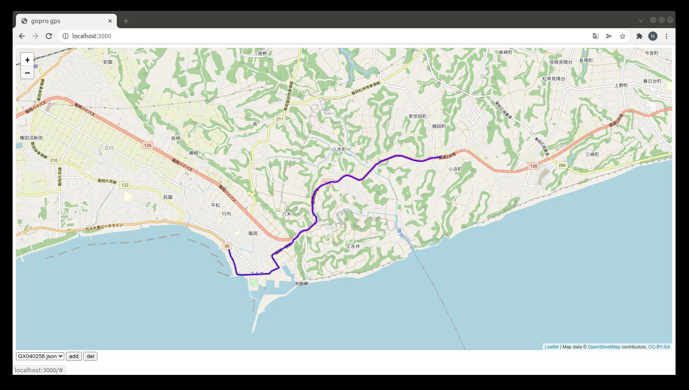

# gopro_gps_ui

- Author: Hiroaki Yaguchi, 947D Tech. Co. Ltd.
- License: MIT

## abstract

This software provides gps tracking log viewer webapp using leafletjs.
Please cite following references for further details about leafletjs.

https://leafletjs.com/

Also this software requires gps information extracted from GoPro Hero 6 or later models.
To extract information from mp4 this software uses following apps.

https://github.com/JuanIrache/gopro-telemetry

## install

### requirements

- nodejs
- yarn
- ffmpeg

### install node pkg

```
$ yarn install
```

## setup gps data

The server will seek all JSON files under `data` dir.
To extract gps json files, use `scripts/extract_gps.sh`.

NOTE: please edit `gopro_utils_path` to the directory where this project is placed.
default: `${HOME}/work/gopro_gps_ui`

```
$ ./extract_gps.sh <filename>
```

This script will write files as changed suffix from .MP4 to .bin and .json to same dir.
It is very useful to use find command to extract for all MP4 files, like

```
$ find <DIR> -name "*.MP4" -exec ./extract_gps.sh {} \;
```

### sample data

`samples/GX040258.json` is a sample gps data, including near Byobu-ga-ura, the east end of Chiba, Japan.



(old format): `samples/GH010085.json` is an old format sample gps data, including Inubo-saki, the east end of Chiba, Japan.


to activate these samples, just copy or symlink file into data dir.

ex) `cd data; ln -s ../samples/*.json ./`

### merge time-series files

GoPro6 splits long movie file for each 3.8GB as following naming rule:

```
G{H,X}<NN><MMMM>.MP4

N: index of file
M: index of movie
```

`scripts/merge_gps.py` can merge splitted gps files into one.

```
$ merge_gps.py <DIR> <PREFIX, GH or GX> <POSTFIX, 4 digits numbers>
```

it will create `GHXX<MMMM>.json` to same dir as input.

## start server

```
$ yarn start
```

and access to

http://localhost:3000/

JSON files under `data` dir are automatically added to selector of left-bottom side.
To show tracking locus, select file and press "add" button.
Also "del" button can remove locus from map.

## acknowledgement

This software uses OpenStreetMap (https://www.openstreetmap.org/)
© OpenStreetMap contributors, CC BY-SA 2.0
Base map and data from OpenStreetMap and OpenStreetMap Foundation.
