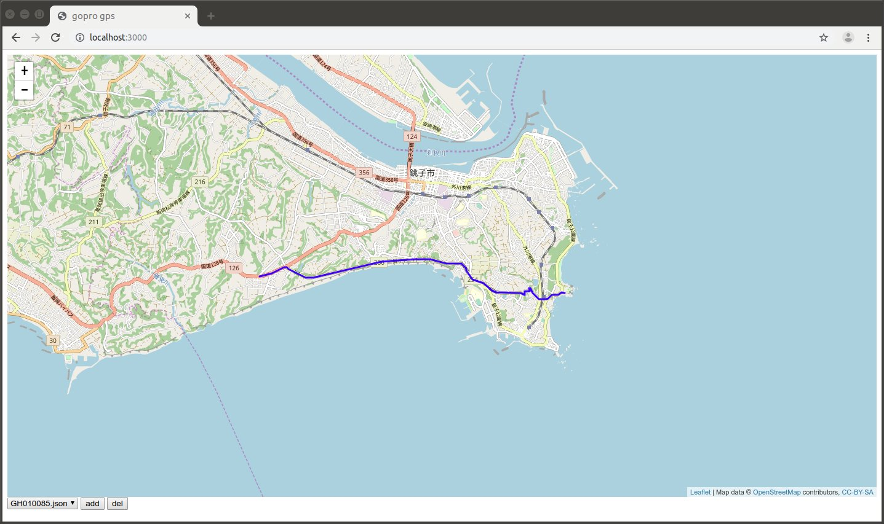

# gopro_gps_ui

- Author: Hiroaki Yaguchi, 947D Tech. Co. Ltd.
- License: MIT

## abstract

This software provides gps tracking log viewer webapp using leafletjs.
Please cite following references for further details about leafletjs.

https://leafletjs.com/

Also this software requires gps information extracted from GoPro Hero 6 or later models.
To extract information from mp4 this software uses following apps.

https://github.com/stilldavid/gopro-utils

## install

### requirements

- nodejs
- yarn
- ffmpeg
- golang

### install node pkg

```
$ yarn install
```

### install gopro-utils

```
$ git clone https://github.com/stilldavid/gopro-utils.git
```

by the default gopro-utils path is set to under home dir.
gopro-utils is written in golang, for ubuntu 16.04 run following.

```
$ sudo apt update
$ sudo apt install golang-1.10
$ export PATH=${PATH}:/usr/lib/go-1.10/bin
$ go get github.com/stilldavid/gopro-utils/telemetry
$ go get github.com/tkrajina/gpxgo/gpx
```

## setup gps data

The server will seek all JSON files under `data` dir.
To extract gps json files, use `scripts/extract_gps.sh`.

```
$ ./extract_gps.sh <filename>
```

This script will write files as changed suffix from .MP4 to .bin and .json to same dir.
It is very useful to use find command to extract for all MP4 files, like

```
$ find <DIR> -name "*.MP4" -exec ./extract_gps.sh {} \;
```

### sample data

`samples/GH010085.json` is a sample gps data, including Inubo-saki, the east end of Chiba, Japan.



to activate this sample, just copy file into data dir. `cp samples/GH010085.json data/`

## start server

```
$ yarn start
```

and access to

http://localhost:3000/

JSON files under `data` dir are automatically added to selector of left-bottom side.
To show tracking locus, select file and press "add" button.
Also "del" button can remove locus from map.
